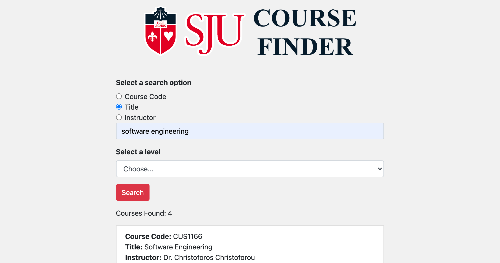

# Course-Search
<b> Link to site: </b> https://sju-course-finder.netlify.app/

## Preview
 <br> 

## About
<b>Course finder</b> is a web application with a back-end API service that provides students access to information about the courses offered at St John's University. 
<br>
<b>Presentation: </b> https://youtu.be/egu6_48MAho

## API Documentation
Use the API base URL: https://sju-course-finder.herokuapp.com/
### Search Course by Course Code
Returns json data for courses containing the specified course code

<ul>
  <li>
    <b>URL:</b>
    <br/>
    /api/by_course_code/{code}
  </li>
  <li>
    <b>Method:</b>
    <br/>
    GET
  </li>
  <li>
    <b>Response:</b>
    
```json
[
      {
        course_code: "CUS610",
        course_level: "graduate",
        title: "Example",
        instructor: "Dr. Example"
        
      }
    ]
```
  </li>
</ul>

### Search Course by Title
Returns json data for courses containing the specified title

<ul>
  <li>
    <b>URL:</b>
    <br/>
    /api/by_title/{title}
  </li>
  <li>
    <b>Method:</b>
    <br/>
    GET
  </li>
  <li>
    <b>Response:</b>
    
```json
[
      {
        course_code: "CUS610",
        course_level: "graduate",
        title: "Example",
        instructor: "Dr. Example"
        
      }
    ]
```
  </li>
</ul>

### Search Course by Instructor
Returns json data for courses containing the specified instructor

<ul>
  <li>
    <b>URL:</b>
    <br/>
    /api/by_instructor/{name}
  </li>
  <li>
    <b>Method:</b>
    <br/>
    GET
  </li>
  <li>
    <b>Response:</b>
    
```json
[
      {
        course_code: "CUS610",
        course_level: "graduate",
        title: "Example",
        instructor: "Dr. Example"
        
      }
    ]
```
  </li>
</ul>

### Search Course by Level
Returns json data for courses containing the specified level

<ul>
  <li>
    <b>URL:</b>
    <br/>
    /api/by_level/{level}
  </li>
  <li>
    <b>Method:</b>
    <br/>
    GET
  </li>
  <li>
    <b>Response:</b>
    
```json
[
      {
        course_code: "CUS610",
        course_level: "graduate",
        title: "Example",
        instructor: "Dr. Example"
        
      }
    ]
```
  </li>
</ul>


### Search Course by Combined Queries
Returns json data for courses containing the specified combined queries

<ul>
  <li>
    <b>URL:</b>
    <br/>
    /api/combined_query/{search_type}/{query}/{level}
  </li>
  <li>
    <b>Method:</b>
    <br/>
    GET
  </li>
  <li>
    <b>Response:</b>
    
```json
[
      {
        course_code: "CUS610",
        course_level: "graduate",
        title: "Example",
        instructor: "Dr. Example"
        
      }
    ]
```
  </li>
</ul>

## Technologies

### Front End
&nbsp; &nbsp;
 &nbsp; &nbsp; &nbsp; 

### Back End

 &nbsp; &nbsp;  


